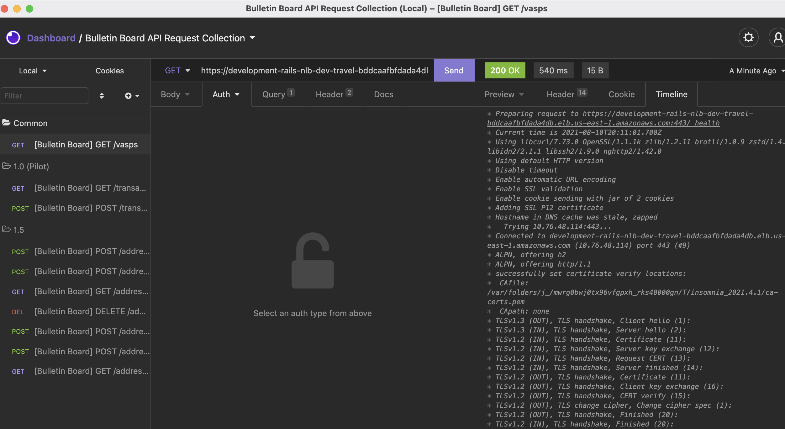

# bulletin-board-api
## Run service using docker (VASP testing)
If you are a VASP and is working to onboard to the service, the easiest solution now is to run the Bulletin Board
Service locally and test your integration. It would not be easy to call our Dev/PreProd stages because of either
network configurations and mTLS certificates. (To call PreProd you need a valid mTLS certificate and also allowed in 
our service config).

### Build and run service via docker
The easiest way to run the service locally is to use docker
````
make docker-build
make docker-up
````

### Check logs
````
docker logs --follow
````

## Development locally
This section is for BulletinBoard engineers to easily set up the local dev environment and make code changes.

### How to update buf.lock
Sometimes the dependency versions (commit) listed in buf.lock become out-of-date because buf repository did not keep all versions.
To update `buf.lock`, run
```
buf mod update
``` 
Note: if you see error you might want to try delete the existing `buf.lock` file.

### Build
Pre-Requisites
We use golangci-lint as the Go linter.
```
brew install golangci-lint
```

Install [buf](https://docs.buf.build/installation)
```
brew tap bufbuild/buf
brew install buf
```

Install wire
```
go get -u golang.org/x/tools/go/packages
go get github.com/google/wire/cmd/wire
```

Install [gofumpt](https://github.com/mvdan/gofumpt)
```
go install mvdan.cc/gofumpt@latest
```

To compile:
```
make compile
```

If you get the following error when `buf generate` :
```
Failure: plugin validate: could not find protoc plugin for name validate.
```
You need to get and install the [protoc-gen-validate](https://github.com/envoyproxy/protoc-gen-validate) plugin.
```
export GOPROXY=https://proxy.golang.org,direct
go get -d github.com/envoyproxy/protoc-gen-validate
go install github.com/envoyproxy/protoc-gen-validate
```

You may also need to ensure all the following are installed:

```
go install \
    github.com/grpc-ecosystem/grpc-gateway/v2/protoc-gen-grpc-gateway \
    github.com/grpc-ecosystem/grpc-gateway/v2/protoc-gen-openapiv2 \
    google.golang.org/protobuf/cmd/protoc-gen-go \
    google.golang.org/grpc/cmd/protoc-gen-go-grpc
```

### Run service locally
1. First setup the dependencies, for now we only have postres database.
```
make local-dep
```
2. Then run the server
```
make server
```
3. Example output
```
{"level":"info","time":"2021-10-07T10:24:25.921-0700","caller":"config/config.go:24","msg":"initialized secret manager config","region":"us-east-1"}
{"level":"info","time":"2021-10-07T10:24:25.923-0700","caller":"filter/cuckoo_filter.go:42","msg":"initializing the cuckoo filter with configuration: ","maxBucketSize":8,"bucketPow":17,"capacity":131072,"totalItem per vasp":2097152}
{"level":"info","time":"2021-10-07T10:24:25.923-0700","caller":"cmd/wire_gen.go:105","msg":"starting server"}
{"level":"info","time":"2021-10-07T10:24:25.923-0700","caller":"cmd/wire_gen.go:111","msg":"HTTP server listening at http://0.0.0.0:7000"}
{"level":"info","time":"2021-10-07T10:24:25.923-0700","caller":"cmd/wire_gen.go:107","msg":"GRPC server listening at http://0.0.0.0:7001"}
```

### Run service locally through nginx-sidecar
We can run both nginx sidecar and the service locally using docker. 
1. you need to build the docker container for nginx-sidecar. 
2. You can run ``` make docker-all```. 
   1. this command will build both the services using a custom docker compose file.
3. Once the services are up, you can curl either the health check through port 7000, or curl with certificates to port 443.
### Run integration test locally
Integration test is written in python for now. You will need to enable virtual env and install the dependencies.

```
cd test/integration_test
python3 -m venv env
source env/bin/activate
pip3 install -r requirements.txt

cd ../..
make integration-test
make manual-test
```

### Change unit test and generate mock
We use [Mockery](https://github.com/vektra/mockery) to generate mocks from interfaces.
We recommend to [install Mockery using Homebrew](https://github.com/vektra/mockery#homebrew).
```
https://github.com/vektra/mockery#homebrew
```
Mockery can generate/update mocks recursively for all interfaces. For example, to generate mocks for all interfaces under `internal/service`, run the following under the `internal/service` folder:
```
mockery --all
```
Mocks will be generated in `internal/service/mocks`, and can be imported by
```
import "bulletin-board-api/internal/service/mocks"
```

## Making API Requests
### Make request to local server (no mTLS)
If we run the service locally, it will not require mTLS authentication, below are instructions on how we can call the API without authentication.

#### Insomnia
We recommend using [Insomnia](https://insomnia.rest/download) API Client to send test requests. We have prepared a request collection that you can import into the tool so you can call API with different environments.
1. Download and install [Insomnia](https://insomnia.rest/download)
2. [Import](https://support.insomnia.rest/article/172-importing-and-exporting-data) the prepared [Bulletin Board Request Collection](./test/manual/Insomnia_2023-08-24.json)
3. You can now send requests. For each request, you can change the body and query parameters as you wish before sending it. You can switch between different Environments to change where the requests are going to be sent to. (The built-in environments are `bb-go-local`, `bb-go-dev` and `bb-go-preprod` for now).

#### Curl
Alternatively, you can use curl to call the local server. Below are some examples.

For more request example, please refer: [Insomnia request collection](https://github.com/USTRWG/bulletin-board-api/blob/76292fd5d2405161e1bc56ff51adc141ba6181cc/test/manual/Insomnia_2021-10-14.json)

```
curl --request GET \
  --url 'http://localhost:7000/v1/vasps/06507e32-c5cd-4a9f-b4ab-1b2787192c8e?=' \
  --header 'grpc-metadata-x-vasp-dns-name: testvasp1.com'
  
curl --request PUT \
  --url 'http://localhost:7000/v1/addresses/9c7bdd2e46af171213aba0217343c518d2b8c3612e7001e768a9bcbb69eb82086031eff8d4c1363894615c143566405fb23be942c26d6fdd4944f9a52090f523?=' \
  --header 'Content-Type: application/json' \
  --header 'Grpc-metadata-x-vasp-dns-name: testvasp1.com' \
  --data '{"chain":"ETHEREUM"}'

## replace "registrationId": "db0c9a05-f456-4d54-9c61-1f6f5e237b6b", from the response above

curl --request PUT \
  --url 'http://localhost:7000/v1/address_ownership_proofs/9c7bdd2e46af171213aba0217343c518d2b8c3612e7001e768a9bcbb69eb82086031eff8d4c1363894615c143566405fb23be942c26d6fdd4944f9a52090f523?=' \
  --header 'Content-Type: application/json' \
  --header 'Grpc-metadata-x-vasp-dns-name: testvasp1.com' \
  --data '{
    "iou": false,
    "chain": "ETHEREUM",
    "prefix": "sample_prefix",
    "signature": "sg",
    "registrationId": "db0c9a05-f456-4d54-9c61-1f6f5e237b6b",
    "proof_type": "ETHEREUM_CONTRACT",
    "aux_proof_data":
    [
        {
            "type": "ETH_CREATE",
            "data":
            {
                "nonce": "1"
            }
        }
    ]
}'

curl --request GET \
  --url 'http://localhost:7000/v1/addresses/9c7bdd2e46af172213aba0217343c518d2b8c3612e7001e768a9bcbb69eb82086031eff8d4c1363894615c143566405fb23be942c26d6fdd4944f9a52090f523?=&chain=ETHEREUM' \
  --header 'Grpc-metadata-x-vasp-dns-name: testvasp1.com'

curl --request DELETE \
  --url 'http://localhost:7000/v1/addresses/9c7bdd2e46af172213aba0217343c518d2b8c3612e7001e768a9bcbb69eb82086031eff8d4c1363894615c143566405fb23be942c26d6fdd4944f9a52090f523?=&chain=ETHEREUM' \
  --header 'Grpc-metadata-x-vasp-dns-name: testvasp1.com'
```

### Make request to deployment on cloud (with mTLS)
When deploying the service to cloud infra (AWS/GCP/etc.), we recommend deploying the service with [Nginx sidecar](https://github.com/USTRWG/nginx-sidecar) (or your own implementation) in order to enable mTLS authentication. Below instructions should help your (client) requests get authenticated by the server.

#### Insomnia
In order to use insomnia to issue requests to server with mTLS enabled, we need to (1) add the CA certificate to insomnia's trust store (via a copy/paste), and (2) attach client certificate to insomnia's requests. In order to achieve (1), we need to first locate insomnia's local trust store. . In this example, insomnia trust store is located at `/var/folders/j_/mwrg0bwj0tx96vfgpxh_rks40000gn/T/insomnia_2021.4.1/ca-certs.pem`

In order to achieve (2), we can follow [this guide](https://support.insomnia.rest/article/178-client-certificates) to attach client certificates with outbound requests. Note that insomnia can only use certificates in PFX format, [the client certificate we provided](test/certs_dev/) are in PEM format, this command should be able to convert PEM files to PFX files. `openssl pkcs12 -inkey bob_key.pem -in bob_cert.cert -export -out bob_pfx.pfx`

Only the client certificate need to be converted to PFX format, the CA cert can be in PEM format when appending it to the local truststore.

#### Curl
Below is an example to curl the server with mTLS (AWS dev environment).
```
curl --cacert test/certs_dev/bundle.crt --key test/certs_dev/client_int_1.key --cert test/certs_dev/client_int_1.crt -kso /dev/null https://development-bbapi-nlb-travel-rul-503376089e6e6323.elb.us-east-1.amazonaws.com:443/health -w "==============\n\n 
| time_namelookup: %{time_namelookup}\n 
| time_connect: %{time_connect}\n 
| time_appconnect: %{time_appconnect}\n 
| time_pretransfer: %{time_pretransfer}\n 
| time_starttransfer: %{time_starttransfer}\n 
| time_total: %{time_total}\n 
| size_download: %{size_download}\n 
| HTTPCode=%{http_code}\n\n" 
```
